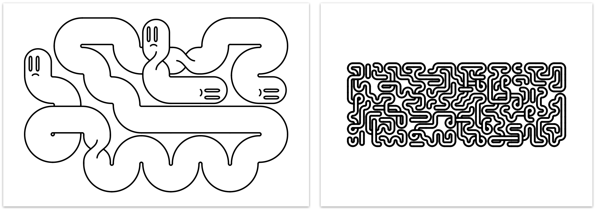
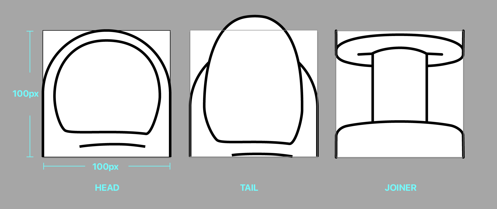

# generative-noodles

Create generative art for pen plotters in Processing.



This software squirts bendy noodle segments into a predefined grid. SVG output is ready for printing or plotting.

## Getting Started

### Requirements

-   [Processing 4](https://processing.org)
-   [ControlP5](https://sojamo.de/libraries/controlP5/) UI library

Install the required Processing libraries using the [Library Manager](https://processing.org/environment/#adding-libraries-tools-and-modes).

### Config

The `sketch.pde` sketch loads configuration data from the `data/config/config.json` file.  
This is the minimum required info in the config file:

```
{
  "graphics": [
    {
      "head": "graphics/roundEnd.svg"
    }
  ]
}
```

Your config will list an array of one or more graphic set objects for which you must specify at minimum the `head` svg graphic. You can optionally include graphics for `tail` and `joiners`.

This config file can also be used to set the size of your output canvas, grid dimensions, and sizing options for the generated noodles.

See the [included config file](sketch/data/config/config.json) as an example or see the [Config Options](#config-options) section for details.

### Head, Tail & Joiner Graphics

You can include pre-made SVGs for noodle ends (head and tail) or to randomly appear in straight sections (I call these "joiners" for some reason).

These SVGs should be drawn vertically and sized so they will intercept noodle edges drawn 100px apart. See the [roundEnd.svg](sketch/data/graphics/roundEnd.svg) graphic for reference.



## Usage

### [Video Walkthrough](https://www.youtube.com/watch?v=1q7dORuGe6I)

### Key Commands

**`G`**: Toggle grid visibility

**`R`**: Randomize noodles and redraw

**`T`**: Increase the size of each individual grid cell

**`E`**: Toggle [Editor View](#editor-view)

**`X`**: Toggle [Blackout Mode](#blackout-mode)

**`P`**: Toggle [Path Edit Mode](#path-edit-mode)

**`I`**: Import a [Mask Image](#mask-images)

**`SHIFT + I`**: Reprocess a [Mask Image](#mask-images)

**`L`**: Load a [Config File](#config)

**`S`**: Save a plot-ready SVG with associated data to the `output` folder.

**`BACKSPACE`**: Delete the selected noodle

### Editor View

Press **`E`** to toggle the graphical Editor View. This control panel lets you change some of the config options without needing to restart the sketch.

You may need to regenerate your noodles (**`R`**) to see the changes reflected.

### Blackout Mode

In Blackout Mode (**`X`**) you can block specific grid cells from being occupied by noodles. Click a cell to toggle its blackout state.

Regenerate your noodles (**`R`**) to see the changes reflected.

### Path Edit Mode

Manually edit the path of any noodle on your canvas.

Toggle Path Edit Mode with **`P`**. Shift-click any noodle to select it. The cells of the selected noodle appear green.

Click the cell at either end the selected noodle to delete it. Click a cell adjacent to either end to extend the noodle into that cell.

Click any straight section of the selected noodle to cycle through the available joiner and twist graphics.

### Mask Images

Instead of manually blacking out cells in the grid, you can load a black and white mask image that represents the areas to be blacked out. When loaded, the mask image will be scaled to fit the size of your grid. Cells appearing over black areas will be blacked out. Cells appearing over white areas will remain available for noodles to be drawn in.

If the aspect ratio of your mask image doesn't match the grid, the extra space will be filled with black.

Press **`I`** to load a mask image.

If you change the grid size with a mask image loaded, you'll need reprocess the mask at the new size (**`SHIFT + I`**) to continue using it.

### Saving Graphics

Press **`S`** to save a plot-ready SVG of your current canvas.

A json data file will be saved alongside your SVG. This contains the config used to create the image. You can load this configuration back into your sketch by pressing **`L`** and selecting the file. This allows you to return to the configuration for a specific image if you want to generate more images in that style.

## Config Options

**`printHeightInches`** (float)  
The height of your output image in inches.

**`printWidthInches`** (float)  
The width of your output image in inches.

**`gridWidth`** (integer)  
The number of horizontal cells in the grid.

**`gridHeight`** (integer)  
The number of vertical cells in the grid.

**`marginInches`** (float)  
The minimum width of the margin between the grid and the edge of your paper. In configurations with a large number of grid cells, this won't apply.

**`useTwists`** (boolean)  
Whether or not to add twist graphics randomly to some straight sections.

**`useJoiners`** (boolean)  
Whether or not to add joiner graphics randomly to some straight sections. If true, graphics will be chosen from the `joiners` array in the graphic set.

**`useCurves`** (boolean)  
Whether to draw curved or square noodles.

**`penSizeMM`** (float)  
The size (in mm) of the pen stroke.

**`noodleThicknessPct`** (float)  
A value between 0 and 1 that defines the width of the noodle, expressed as a percentage of the width of a grid cell.

A value of 0.5 will draw a noodle that is half the width (50%) of the cells in the grid.

**`numNoodles`** (integer)  
The maximum number of noodles to attempt to draw. The actual number of noodles may be lower if the grid fills before the maximum number is reached.

**`minLength`** (integer)  
**`maxLength`** (integer)  
Noodles are created with target lengths chosen from a random value between `minLength` and `maxLength`. A noodle will grow, filling space until it either runs out of space, or reaches its target length.

`minLength` just defines the lower bounds for the target length, not an actual threshold for noodle length. For this reason, noodles will often be drawn shorter than the `minLength` setting.

**`allowOverlaps`** (number)  
Whether or not to allow noodles to overlap.

**`graphics`** (array of objects)
Each object in this array defines a set of graphics to be used for one noodle type. This lets you have multiple types of noodles with graphics that are consistent per noodle.

-   **`head`** (string)
    Path to the graphic that represents a noodle end. Required.

-   **`tail`** (string)
    Optional path to the graphic that represents the opposite end of the noodle. If this is omitted, the head graphic will be used for both ends. If `randomized` ends is set to true, then head graphics from a random graphic set will be used instead of the tail.

-   **`joiners`** (array of strings)
    Array of paths to joiner graphics (a straight section that connects to other segments). Your noodle will randomly choose graphics from this array. Optional.

**`randomizeEnds`** (boolean)
When set to `true`, noodles will choose random end caps from the `head` graphics in the `graphics` array.

When set to `false`, each noodle will use the associated `head` and `tail` graphics (or two of the same `head` graphic if no `tail` is defined).

**`blackoutCells`** (2D arrays of integers)
An array of cell columns indicating which cells should be blocked from noodles appearing in them. Open cells are marked with a `0` and blacked out cells are marked with a `12`.

You probably don't want to create this manually.  
Blackout cells can be edited in the sketch (press `X` to enter blackout mode). The array of cells will then be output to the data file when an image is saved.

## Support

This is a personal project and is mostly unsupported.  
That being said, I'm happy to hear feedback or answer questions.

## License

This project is licensed under the Unlicense - see the [LICENSE](LICENSE) file for details.
